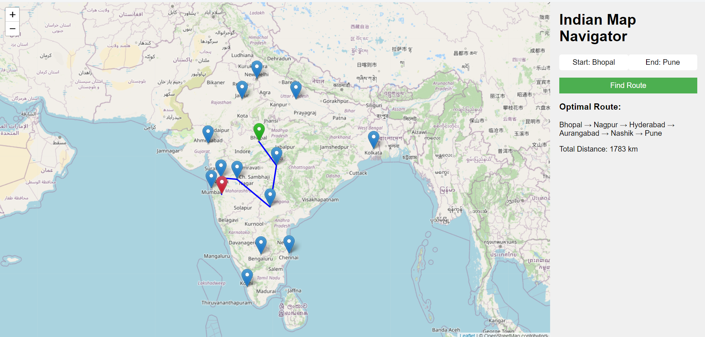

# Interactive Indian Map Navigator using Dijkstra's Algorithm 🌍️




>  An interactive web application that allows users to find the optimal route between cities in India using Dijkstra's algorithm.

## 🚀 Objectives
- Implement **Dijkstra's algorithm** for finding the shortest path in a weighted graph representing Indian cities and their connections.
- Develop a backend server to handle route calculations and city data management.
- Create an interactive frontend with a map interface for user interactions and route visualization.
- Demonstrate the practical application of **graph theory** and advanced **data structures** in solving real-world problems.

## ✨ Features
- **Interactive Map Interface**: Uses Leaflet.js for map visualization and interaction. Users can select cities by clicking on the markers.
- **Shortest Path Calculation**: Implements Dijkstra's Algorithm to calculate the shortest route between cities.
- **Real-time Route Display**: Displays the calculated route on the map with polylines and shows the total distance.
- **City Selection**: Allows users to select both a start and an end city to compute the shortest path.
- **Reset Functionality**: Users can reset the map view and clear the route for a new selection.

## 🌐 Demo
1. Click on the markers on the map to select the start and end cities.
2. Once selected, click the **"Find Route"** button to compute the shortest route.
3. The route and the total distance will be displayed on the map and sidebar.

## 🗂️ Project Structure
```
indian-map-navigator/
├── node_modules/       # Dependencies for the project (installed via npm) 
├── image.png           # Screenshot/image of the application
├── index.html          # Frontend interface
├── package-lock.json   # Dependency tree for npm
├── package.json        # Project metadata and dependencies
├── script.js           # Frontend logic for map interaction
└── server.js           # Backend server implementing Dijkstra's Algorithm
```

## ⚙️ Installation and Setup
1. Clone the repository to your local machine:
    ```bash
    git clone https://github.com/yourusername/Interactive-Indian-Map-Navigator-using-Dijkstra-s-Algorithm.git
    cd Interactive-Indian-Map-Navigator-using-Dijkstra-s-Algorithm
    ```

2. Install the dependencies:
    ```bash
    npm install
    ```

3. Run the application:
    ```bash
    node server.js
    ```

4. Open your browser and navigate to:
    ```
    http://localhost:3000
    ```


## 🛠️ Tech Stack & Dependencies


- **Express**: Node.js framework used for server creation and API handling.
- **Leaflet.js**: JavaScript library for interactive maps.
- **Body-Parser**: Middleware to parse incoming request bodies in JSON format.
- **Cors**: Middleware to enable cross-origin requests.

To install all dependencies, run:
```bash
npm install
```

## 🧑‍💻 How It Works
> **Backend (server.js)**

The backend uses an in-memory graph representation of Indian cities, where each city is connected to others with a specified distance (in kilometers). When a route is requested, the backend uses Dijkstra's algorithm to compute the shortest path and sends it back to the frontend.

> **Frontend (index.html, script.js)**

The frontend uses Leaflet.js to display an interactive map of India. Cities are marked with clickable markers. Users select a start and end city, and upon pressing "Find Route," the shortest path is calculated and displayed on the map.


## 📡 API Endpoints
 - `GET /cities:` Returns a list of cities with their latitude and longitude.
- `POST /route:` Accepts a JSON object with start and end city names and returns the optimal path and total distance.

#### Example Request:
```
POST http://localhost:3000/route
Content-Type: application/json
{
  "start": "Mumbai",
  "end": "Pune"
}
```

#### Example Response:
```
{
  "path": ["Mumbai", "Pune"],
  "cost": 150
}
```


## 📖 Usage
1. Start the server:
```
node server.js
```
2. Open the application in your browser and interact with the map. Select a start and end city by clicking on the city markers and press "Find Route" to calculate the shortest path.
3. You can also reset the map by pressing the "Reset" button, which will clear the selected cities, route, and return the map to its original zoom level.

## 🔮 Future Work
- Implementation of alternative routing algorithms (A*, Bellman-Ford) for comparison
- Addition of multi-stop route planning functionality
- Incorporation of more detailed road network data
- Implement user authentication and personalized saved routes.
- Add traffic data to dynamically calculate the fastest route considering live conditions.

## 🤝 Contributing
>Contributions are welcome! Please feel free to submit a Pull Request or open an issue if you find any bugs or have suggestions for improvements.
